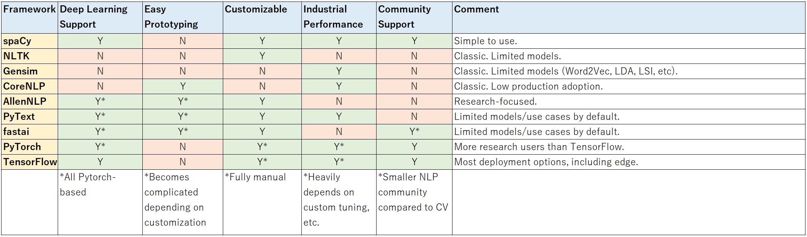
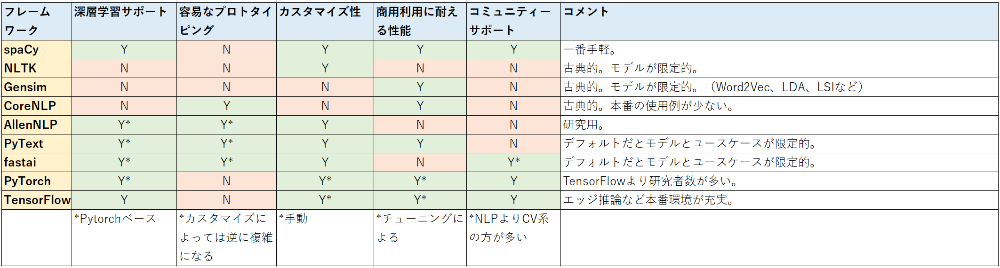

# SpaCy Tutorial 
#### Gateway to Natural Language Processing (**NLP**)
------------ 

[日本語はこちら](#spacyチュートリアル)  

This tutorial will loosely follow spaCy's [official tutorial](https://course.spacy.io/).  

## Code  
1. [Introduction to spaCy](https://github.com/yuibi/spacy_tutorial/blob/master/code/01_intro_to_spacy.ipynb)  
    - Installation  
    - Tokenization  
    - Stop words  
    - Lemmatization  
    - Sentence Segmentation  
    - Part-of-speech (**POS**) tagger  
    - Named entity recognizer (**NER**)  
    - Syntactic dependency parser  
2. [Intermediate spaCy](https://github.com/yuibi/spacy_tutorial/blob/master/code/02_intermediate_spacy.ipynb)  
    - Word vectors  
    - Working with big dataset  
    - Pipelines  
3. [Advanced spaCy](https://github.com/yuibi/spacy_tutorial/blob/master/code/03_advanced_spacy.ipynb)  
    - Using GPU  
    - Model training  
    - Transfer learning from **BERT** (text classifier)  
    - Annotation with Prodigy  

## NLP Frameworks  
  
*** Based on my experience. Partially taken from [PyText paper](https://arxiv.org/abs/1812.08729)  

## When to use spaCy  
1. End-to-end NLP analysis and machine learning  
2. Preprocessing for downstream analysis and machine learning  
3. Baseline for more complex custom models  
4. The following tasks (The ones in **bold** are recommended tasks):  
    - ~~Automatic speech recognition~~  
    - Constituency parsing ([partially supported](https://spacy.io/universe/project/self-attentive-parser))  
    - Coreference resolution ([partially supported](https://cs.stanford.edu/people/kevclark/resources/clark-manning-emnlp2016-deep.pdf))  
    - Active learning annotation (thru Prodigy)  
    - Chunking (only noun phrase)  
    - ~~Crossmodal~~  
    - Data masking (possible with spaCy's models and Matcher)  
    - **Dependency parsing**  
    - ~~Dialogue~~  
    - Entity linking  
    - ~~Grammatical error correction~~  
    - Information extraction (possible with spaCy's models and Matcher)  
    - Intent Detection ~~and Slot Filling~~  
    - Language modeling ([ULMFiT](https://arxiv.org/abs/1801.06146)-like language model is experimental)  
    - **Lemmatization**  
    - ~~exical normalization~~  
    - ~~Machine translation~~  
    - ~~Missing elements~~  
    - ~~Multi-task learning~~  
    - ~~Multi-modal~~  
    - **Named entity recognition**  
    - Natural language inference ([partially supported](https://github.com/explosion/spaCy/tree/master/examples/keras_parikh_entailment))  
    - **Part-of-speech tagging**  
    - Question answering ([partially supported](https://spacy.io/universe/project/adam_qas))  
    - ~~Relationship extraction~~  
    - **Rule-based Matcher** (you don't need a model for this :) )  
    - Semantic textual similarity  
    - ~~Semantic role labeling~~  
    - Sentiment analysis  
    - **Sentence segmentation**  
    - **Stop words**  
    - **Tokenization** (character, word, sub-word-level)  
    - ~~Summarization~~  
    - **Text classification**  
    - ~~Topic modeling~~  
    - Word Embedding (standard Word2Vec/GloVe, [sense2vec](https://arxiv.org/abs/1511.06388), and contextualized)  
    - WordNet ([partially supported](https://spacy.io/universe/project/spacy-wordnet))  

------------  

# SpaCyチュートリアル  
#### 自然言語処理（**NLP**）のゲートウェイ  
------------  

このチュートリアルはspaCyの[公式チュートリアル](https://course.spacy.io/)と[Megagon Labsのスライド](https://www.slideshare.net/MegagonLabs/ginza-cabocha-udpipe-stanford-nlp)、[オージス総研の記事](https://www.ogis-ri.co.jp/otc/hiroba/technical/similar-document-search/part4.html)を参考にしています。  

## コード  
1. [spaCy初級](https://github.com/yuibi/spacy_tutorial/blob/master/code/ja_01_intro_to_spacy.ipynb)   
    - spaCyとGiNZAのインストール  
    - トークン化  
    - ストップワード  
    - 見出し語化  
    - 文単位分割  
    - 品詞（**POS**）タグ付け  
    - 固有表現抽出（**NER**）  
    - 依存構文解析のラベル付け  
2. [spaCy中級](https://github.com/yuibi/spacy_tutorial/blob/master/code/ja_02_intermediate_spacy.ipynb)  
    - 単語ベクトル  
    - 大規模データ処理  
    - パイプライン処理  
3. [spaCy上級](https://github.com/yuibi/spacy_tutorial/blob/master/code/ja_03_advanced_spacy.ipynb)  
    - GPUの使用  
    - モデル学習  
    - **日本語BERT**の転移学習（文書分類）  
    - Prodigyでのラベル付け  

## NLPのフレームワーク  
  
*** 個人的な経験に基づく。[PyTextの論文](https://arxiv.org/abs/1812.08729)を一部抜粋  

## spaCyの使用例  
1. 自然言語の分析から機械学習まで全て  
2. 下流タスク（分析や機械学習）の前処理  
3. より複雑なカスタムモデル用のベースライン  
4. 以下のタスク（**太字**が推奨タスク）:  
    - ~~Automatic speech recognition~~  
    - Constituency parsing ([一部サポート](https://spacy.io/universe/project/self-attentive-parser))  
    - Coreference resolution ([一部サポート](https://cs.stanford.edu/people/kevclark/resources/clark-manning-emnlp2016-deep.pdf))  
    - Active learning annotation (Prodigyで)  
    - Chunking (名詞句のみ)  
    - ~~Crossmodal~~  
    - Data masking (spaCyのモデルとMatcherで可能)  
    - **Dependency parsing（依存構文解析のラベル付け）**  
    - ~~Dialogue~~  
    - Entity linking  
    - ~~Grammatical error correction~~  
    - Information extraction (spaCyのモデルとMatcherで可能)  
    - Intent Detection ~~and Slot Filling~~  
    - Language modeling ([ULMFiT](https://arxiv.org/abs/1801.06146)のようなLMは試験的)  
    - **Lemmatization（見出し語化）**  
    - ~~exical normalization~~  
    - ~~Machine translation~~  
    - ~~Missing elements~~  
    - ~~Multi-task learning~~  
    - ~~Multi-modal~~  
    - **Named entity recognition（固有表現抽出）**  
    - Natural language inference ([一部サポート](https://github.com/explosion/spaCy/tree/master/examples/keras_parikh_entailment))  
    - **Part-of-speech tagging（品詞タグ付け）**  
    - Question answering ([一部サポート](https://spacy.io/universe/project/adam_qas))  
    - ~~Relationship extraction~~  
    - **Rule-based Matcher（ルールベースのマッチング）** (モデル不要)  
    - Semantic textual similarity  
    - ~~Semantic role labeling~~  
    - Sentiment analysis  
    - **Sentence segmentation**  
    - **Stop words（ストップワード）**  
    - **Tokenization（トークン化）** (character, word, sub-word-level)  
    - ~~Summarization~~  
    - **Text classification（文章分類）**  
    - ~~Topic modeling~~  
    - Word Embedding (通常のWord2VecやGloVe、[sense2vec](https://arxiv.org/abs/1511.06388)、文脈を考慮した単語ベクトルなど)  
    - WordNet ([一部サポート](https://spacy.io/universe/project/spacy-wordnet))  